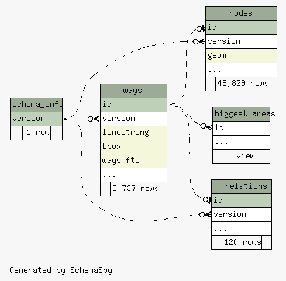

# Introduction

This document explain what data application is being developed around the
dataset provided by OpenStreetMap project: [OSM](
https://wiki.openstreetmap.org/wiki/Main_Page ) . Here we have a high view, and
hopefully a good detailed document for all database objects created around the
fundamental schema generated by OSMOSIS and osm2pgsql tool from the data
exported by OSM and transformed to PostGRESQL tables.

# The Dataset

The dataset is derived from OSM [Data API](https://api.openstreetmap.org/api/0.6/)
Using the bound box given by:

```{text}
bbox(-45.091,-23.448,-45.066,-23.423)

WKT notation:
POLYGON((-45.091 -23.448,-45.091 -23.423,-45.066 -23.423,-45.066 -23.448,-45.091 -23.448))

# Geo Json File
# http://geojson.io/#map=15/-23.4355/-45.0785
{
   "geometry" : {
      "coordinates" : [
         [
            [
               -45.091,
               -23.448
            ],
            [
               -45.091,
               -23.423
            ],
            [
               -45.066,
               -23.423
            ],
            [
               -45.066,
               -23.448
            ],
            [
               -45.091,
               -23.448
            ]
         ]
      ],
      "type" : "Polygon"
   },
   "type" : "Feature",
   "properties" : {
       "name" : "Ubatuba - SP (Partial)"
   }
}

```

That could be changed by environment variable OSM_BBOX or directive flag on make.
But should be careful, since there constraints in API for the size of this rectangle.

# Fundamental tables

Most fundamental schema tables is found here:



Nodes representing points, Ways lines, and Relations as bag for points,
polygons and lines. More about this schema is found on osm2psql documentation.

The dataset is small, as the total numbers show. But is the same structure if
we retrieve more data. # Database model

# Analysis: Reasons and Objectives.

## Preamble

Most part of this data reflects the geometries of interest for users of OSM
project. OSM has a rich manual for description of the objects it maps, such as
streets, places, buildings, public agencies and much more. The process to feed
the data is a collective one and many hands and eyes plays a role, as there are
hundreds of thousands users that help map their localities, mapping thousands
of objects that are mostly described by the use of tags and a few metadata
included in various forms.

## Basic descriptive view

We define a couple regions as the regions of interest. Those can be viewed
in this [map](https://gist.github.com/marcoarthur/2f0fde0972363c4344659ad7f06a1267).
Those are polygons that defines regions in Ubatuba-SP municipality, and was
previous extracted from IBGE the main institution responsible for Brazil statistics
and geography and that also realizes the Brazilian census.

Most simple of analysis runs on basic descriptive view of the data. As such
we summarise and group them. Following the descriptive field of tags for entities.

Particularly interesting is check how tagged are geometries, such as lines or
polygons.

The descriptive parts of the dataset can be summarised from the wiki page of
OSM tags where we run a scrapper to understand textual information the tags
could provide.

## Economy point of view

## How much Government devices are mapped

## Another sources of data

## Aspects of Social


Around that 
